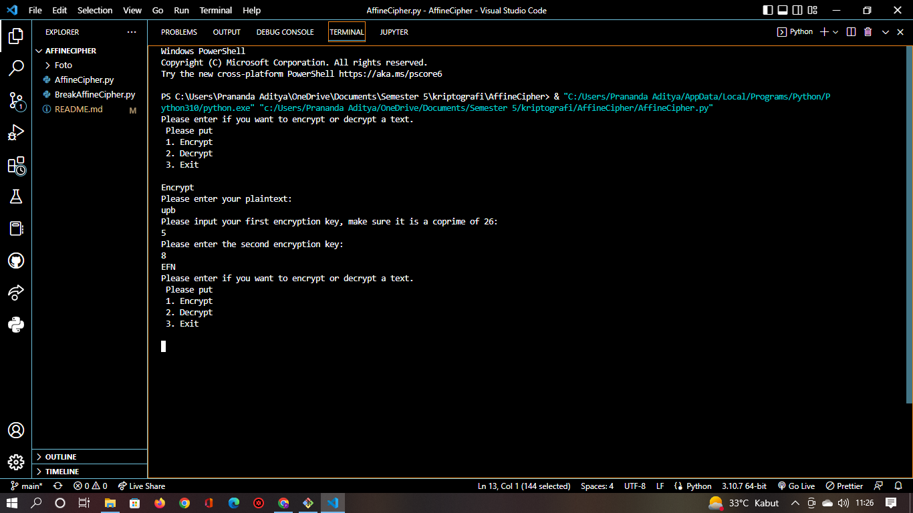

# AffineCipher

# Nama : Prananda Aditya

# Nim : 312010130

# Kelas : TI.20.A1

### 1. Dengan kata plaintext <b>"upb"</b> Dengan first encrypt key <b>"5"</b> Dengan second encrypt key <b>"8"</b> Ini hasil dari kode tersebut 

